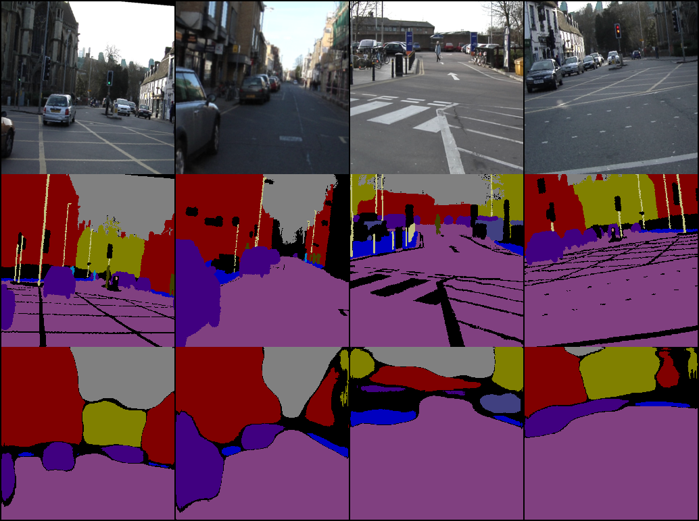
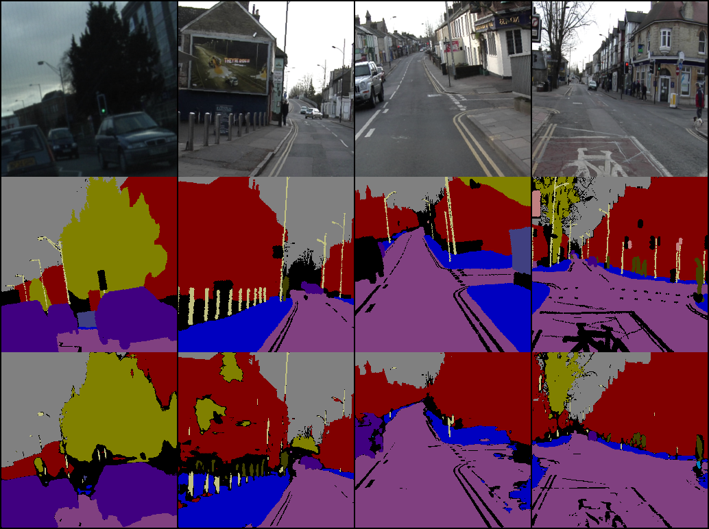
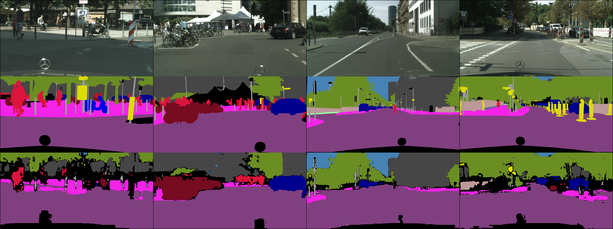
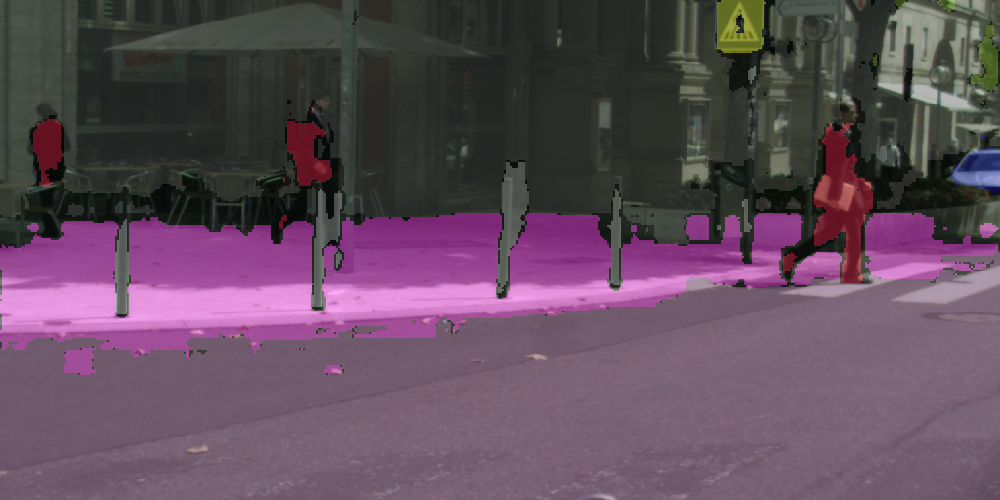

# Semantic Segmentation

В данном репозитории реализованы некоторые методы семантической сегментации, а имено:

* [SegNet](https://arxiv.org/pdf/1511.00561) на наборах данных [CamVid](https://mi.eng.cam.ac.uk/research/projects/VideoRec/CamVid/)
* [U-Net](https://arxiv.org/pdf/1505.04597) на наборах данных [CamVid](https://mi.eng.cam.ac.uk/research/projects/VideoRec/CamVid/)
* [Fast-SCNN](https://arxiv.org/abs/1902.04502) на наборе данных [Cityscapes](https://www.cityscapes-dataset.com)

После обучения модели тестировались на метриках Dice и IoU.

Результаты обучения следующие:

|<center>Model| <center>mIoU  | <center>mean Dice  |
|:-----------:|:-------------:|:------------------:|
|SegNet       | 0.433         | 0.5                |
|U-Net        | 0.459         | 0.546              |
|Fast-SCNN    | 0.388         | 0.447              |


## Содержание

  + [Установка](#Установка)
  + [SegNet](#segnet)

### Установка

```
git clone [link]
cd Segmentation/
```

Далее необходимо скачать наборы данных в корневую папку проекта. Ссылки на наборы данных: [Cityscapes](https://www.cityscapes-dataset.com), [CamVid](https://www.kaggle.com/jcoral02/camvid). Для Cityscapes необходимо скачать gtFine, leftImg8bit и demoVideo. gtFine и leftImg8bit должны включать в себя директории train, test и val, demoVideo – stuttgart_00, stuttgart_01, stuttgart_02.

## SegNet

Примеры сегментации:



Оценка качества обучения по метрикам Dice и IoU по каждому классу:    

|Class|Bicyclist|Building|Car|Column_Pole|Fence|Pedestrian|Road|Sidewalk|SignSymbol|Sky|Tree|
|:-:|:-:|:-:|:-:|:-:|:-:|:-:|:-:|:-:|:-:|:-:|:-:|
|IoU|0.077|0.755|0.647|0.0|0.294|0.003|0.88|0.52|0.048|0.878|0.663|
|Dice|0.098|0.853|0.776|0.0|0.393|0.006|0.936|0.665|0.048|0.935|0.794|

### Запуск

```
python3 SegNet.py
```
Для проведения тестов на предобученной модели
```
python3 SegNet.py --pretrain 1 --train 0
```


## U-Net

Примеры сегментации:



Оценка качества обучения по метрикам Dice и IoU по каждому классу:    

|Class|Bicyclist|Building|Car|Column_Pole|Fence|Pedestrian|Road|Sidewalk|SignSymbol|Sky|Tree|
|:-:|:-:|:-:|:-:|:-:|:-:|:-:|:-:|:-:|:-:|:-:|:-:|
|IoU|0.091 | 0.686 | 0.76 | 0.142 | 0.07 | 0.246 | 0.858 | 0.658 | 0.003 | 0.908 | 0.63|
|Dice|0.142 | 0.812 | 0.859 | 0.247 | 0.12 | 0.389 | 0.923 | 0.791 | 0.006 | 0.952 | 0.77|

### Запуск

```
python3 UNet.py
```
Для проведения тестов на предобученной модели
```
python3 UNet.py --pretrain 1 --train 0
```

## Fast-SCNN


Примеры сегментации:



Оценка качества обучения по метрикам Dice и IoU по каждому классу:    

|Class|road| sidewalk| building| wall| fence| pole| traffic light| traffic sign| vegetation| terrain| sky| person| rider| car| truck| bus| train| motorcycle| bicycle|
|:-:|:-:|:-:|:-:|:-:|:-:|:-:|:-:|:-:|:-:|:-:|:-:|:-:|:-:|:-:|:-:|:-:|:-:|:-:|:-:|
|IoU|0.887|0.473|0.724|0.093|0.091|0.136|0.0|0.151|0.789|0.242|0.796|0.304|0.071|0.741|0.345|0.417|0.667|0.274|0.168|
|Dice|0.938|0.626|0.838|0.112|0.118|0.232|0.0|0.247|0.88|0.33|0.874|0.436|0.071|0.847|0.345|0.417|0.668|0.274|0.245|

Видео с наложенной маской:



### Запуск

```
python3 FastSCNN.py
```
Для проведения тестов на предобученной модели
```
python3 FastSCNN.py --pretrain 1 --train 0
```
Чтобы создать видео с наложенной маской
```
python3 Videotest.py --model FastSCNN
```
